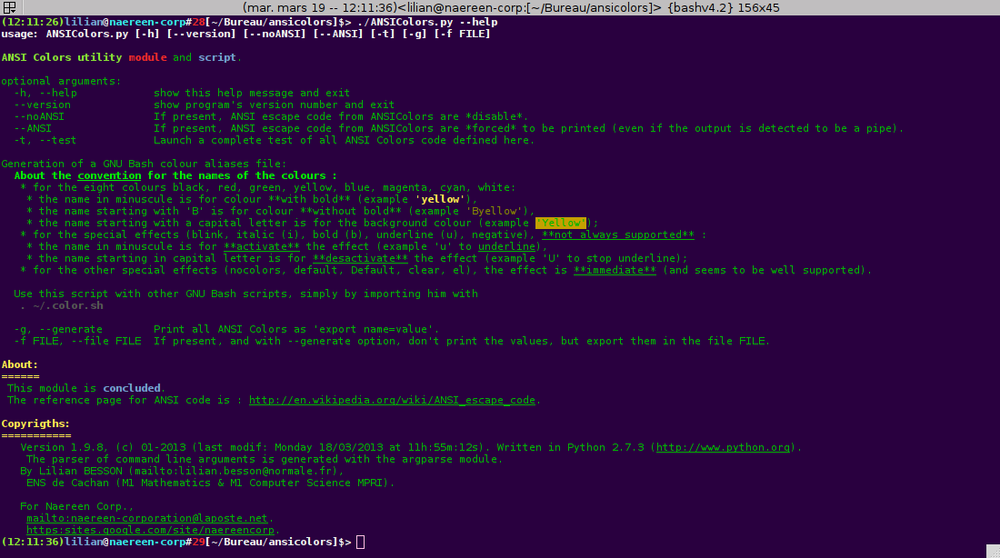
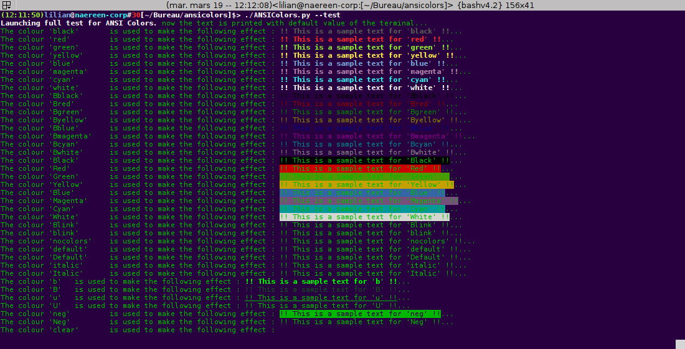

=========================================
Welcome to ansicolortags's documentation!
=========================================

Welcome to the documentation for ``ansicolortags``, a Python 2 or 3 module to use ANSI colors in a terminal.

- This project is open-source `here on BitBucket <https://bitbucket.org/lbesson/ansicolortags.py>`_.

- This project is also available from Pypi, so a quick overview and the last release can be downloaded `from Pypi <https://pypi.python.org/pypi/ansicolortags>`_: `<https://pypi.python.org/pypi/ansicolortags>`_ !

------------------------------------------------------------------------------

.. _installation:
.. include:: INSTALL

------------------------------------------------------------------------------

Examples
--------

The function ``printc``
~~~~~~~~~~~~~~~~~~~~~~~

The main function of this module is ``printc``, e.g. ``printc("my string")``
This function works exactly like ``print("my string")``.

For instance, a quick description of super hero's costumes can be done like this: ::

    >>> printc("<reset><white>Batman's costume is <black>black<white>, Aquaman's costume is <blue>blue<white> and <green>green<white>, and Superman's costume is <red>red<white> and <blue>blue<white> ...")
    Batman's costume is black, Aquaman's costume is blue and green, and Superman's costume is red and blue ...

Sorry, but it is hard to embed colors in a Sphinx generated web pages.

``python -m ansicolortags --help``
~~~~~~~~~~~~~~~~~~~~~~~~~~~~~~~~~~

This command shows the help of the script, colored with the tools defined in the script :

``python -m ansicolortags --test``
~~~~~~~~~~~~~~~~~~~~~~~~~~~~~~~~~~

This command shows a complete test of all tags defined in the module :

Complete documentation
----------------------

And, a detailed description of every function is available
on the documentation `of the module ansicolortags <ansicolortags.html>`_.

-----------------------------------------------------------------------------

Author
------

Hi, I am Lilian Besson, a French student at ÉNS de Cachan, in Mathematics and computer science (CS).

If needed, feel free to contact me :

 1. either with `this web page <http://perso.crans.org/besson/contact/>`_;
 2. or via my bitbucket account `lbesson <https://bitbucket.org/lbesson>`_;
 3. or via email `here (remove the [] and change DOT to . and AT to @
    <mailto:lilian DOT besson AT ens-cachan [DOT] org>`_.

You can use `this form <https://bitbucket.org/lbesson/ansicolortags.py/issues?status=new&status=open>`_ to inform me of a bug on ``ansicolortags.py``:
`<https://bitbucket.org/lbesson/ansicolortags.py/issues?status=new&status=open>`_ !

Index and tables
----------------

* :ref:`genindex`
* :ref:`modindex`
* :ref:`search`

Table of contents
-----------------

.. toctree::
   :maxdepth: 5

   install
   ansicolortags
   todo

------------------------------------------------------------------------------

This project is currently in version |version|, release |release|.
Last update of this doc was made |today|.

.. note::  This project is based on my old `ANSIColors-balises <https://pypi.python.org/pypi/ANSIColors-balises>`_ project, which was only for Python 2.7.

.. _licence:

The MIT License (MIT)
---------------------
.. include:: LICENSE

.. (c) Lilian Besson 2012-2016
