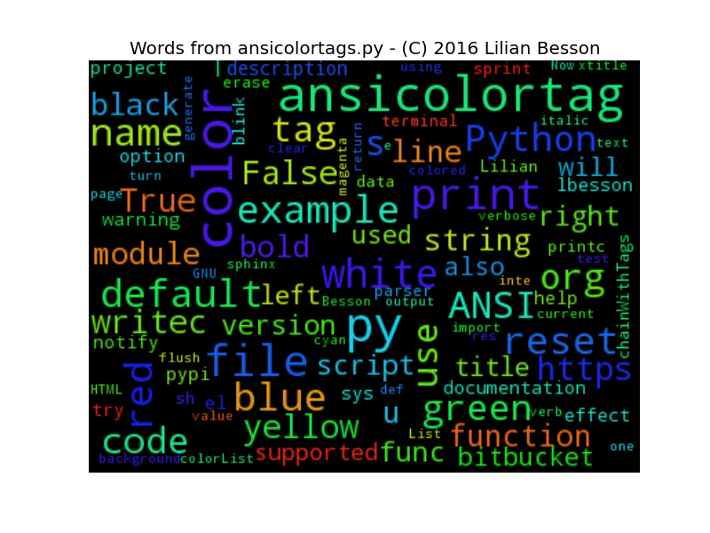

=========================================
Welcome to ansicolortags's documentation!
=========================================

Welcome to the documentation for ``ansicolortags``, a Python 2 or 3 module to use ANSI colors in a terminal application from Python.

The ``ansicolortags`` module provides an efficient and useful function (:py:func:`printc`) to print colored text in a terminal application with Python 2 and 3, with a *HTML-tag* like style: ::

    >>> from ansicolortags import printc  # Import the function
    >>> printc("I like my sky to be <blue>blue<reset>, not <black>dark<reset> !")
    I like my sky to be blue, not dark !

- This project is open-source `here on BitBucket <https://bitbucket.org/lbesson/ansicolortags.py>`_.

- This project is also available from Pypi, so a quick overview and the last release can be downloaded `from Pypi <https://pypi.python.org/pypi/ansicolortags>`_: `<https://pypi.python.org/pypi/ansicolortags>`_ !

------------------------------------------------------------------------------

.. _installation:
.. include:: INSTALL

------------------------------------------------------------------------------

Examples
--------

The function :py:func:`ansicolortags.printc`
~~~~~~~~~~~~~~~~~~~~~~~~~~~~~~~~~~~~~~~~~~~~

The main function of this module is ``printc`` (:py:func:`ansicolortags.printc`),
for example use it like ``printc("my string with color tags")``.
This function works *exactly* like ``print("my string with color tags")``.

For instance, a quick description of super hero's costumes can be done like this: ::

    >>> printc("<reset><white>Batman's costume is <black>black<white>, Aquaman's costume is <blue>blue<white> and <green>green<white>, and Superman's costume is <red>red<white> and <blue>blue<white> ...<reset>")
    Batman's costume is black, Aquaman's costume is blue and green, and Superman's costume is red and blue ...

(Sorry, but it is hard to embed colors in the output of a Python command in a `Sphinx generated web-pages <http://sphinx-doc.org/>`_.)

Another example, it will print the text *"France flag is blue, white and red !"* with appropriate colors: ::

    >>> from ansicolortags import printc  # Import the function
    >>> printc("France flag is <blue>blue<reset>, <white>white<reset>, and <red>red<reset> !")
    France flag is blue, white and red !

The function :py:func:`printc` should be imported from :py:mod:`ansicolortags` (:py:func:`ansicolortags.printc`).

Note that other useful functions are defined:
:py:func:`ansicolortags.writec` to write to a file,
:py:func:`ansicolortags.xtitle` to change the title of the terminal,
:py:func:`ansicolortags.sprint` to convert all the tags (e.g., ``<red>``) in a string to their ANSI Code value (e.g., ``\033[01;31m``), etc.

------------------------------------------------------------------------------

The script ``ansicolortags.py``
-------------------------------

But the project also installs a script, ``ansicolortags.py``, which can be executed directly,
or called with ``python -m ansicolortags`` after installation.

The script itself does not have a useful purpose, except for testing and demonstrating the capabilities of this project.
If needed: :download:`ansicolortags.py`.

``python -m ansicolortags --help``
~~~~~~~~~~~~~~~~~~~~~~~~~~~~~~~~~~

This command shows the help of the script, colored with the tools defined in the script:

``python -m ansicolortags --test``
~~~~~~~~~~~~~~~~~~~~~~~~~~~~~~~~~~

This command shows a complete test of all tags defined in the module:

``--ANSI`` or ``--noANSI`` option
~~~~~~~~~~~~~~~~~~~~~~~~~~~~~~~~~

You can force to use ANSI codes (even if they appear to not be supported be the output, e.g. a pipe) with the ``--ANSI`` flag option,
or force to disable them with the ``--noANSI`` flag option:

``python -m ansicolortags --generate``
~~~~~~~~~~~~~~~~~~~~~~~~~~~~~~~~~~~~~~

This command can be used to generate `a .color.sh file <https://bitbucket.org/lbesson/bin/src/master/.color.sh>`_, to be used in any GNU Bash script:

------------------------------------------------------------------------------

Complete documentation
----------------------

And, a detailed description of every functions and every constants of the :py:mod:`ansicolortags` module
is available on the documentation `of the module ansicolortags <ansicolortags.html>`_
(automatically generated from the docstrings in the file).

Contact the author if needed?
~~~~~~~~~~~~~~~~~~~~~~~~~~~~~

Hi, I am Lilian Besson, a French student at ÉNS de Cachan, in Mathematics and computer science (CS).

If needed, feel free to contact me :

 1. either with `this web page <http://perso.crans.org/besson/contact/>`_;
 2. or via my bitbucket account `lbesson <https://bitbucket.org/lbesson>`_;
 3. or via email `here (remove the [] and change DOT to . and AT to @
    <mailto:lilian DOT besson AT ens-cachan [DOT] org>`_.

You can use `this form <https://bitbucket.org/lbesson/ansicolortags.py/issues?status=new&status=open>`_ to inform me of a bug on ``ansicolortags.py``:
`<https://bitbucket.org/lbesson/ansicolortags.py/issues?status=new&status=open>`_ !

Index and tables
----------------

* :ref:`genindex`
* :ref:`modindex`
* :ref:`search`

Table of contents
~~~~~~~~~~~~~~~~~

.. toctree::
   :maxdepth: 5

   install
   ansicolortags
   todo

------------------------------------------------------------------------------

This project is currently in version |version|, release |release|.
Last update of this doc was made |today|.

.. image:: https://readthedocs.org/projects/ansicolortags/badge/?version=latest
   :target: http://ansicolortags.readthedocs.io/

.. note::  This project is based on my old `ANSIColors-balises <https://pypi.python.org/pypi/ANSIColors-balises>`_ project, which was only for Python 2.7.

.. _licence:

The MIT License (MIT)
~~~~~~~~~~~~~~~~~~~~~
.. include:: LICENSE

------------------------------------------------------------------------------

Cloud of words
~~~~~~~~~~~~~~

.. (c) Lilian Besson 2012-2016
